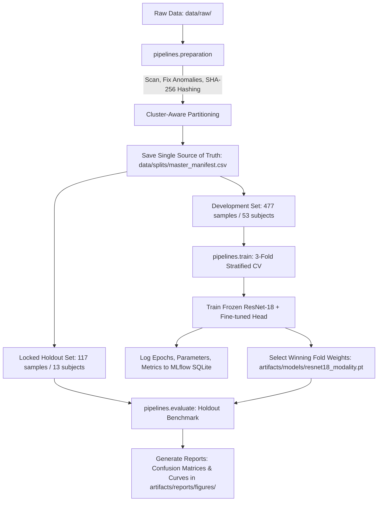

# ParkinDraw Machine Learning Pipeline

This sub-project hosts the complete end-to-end Machine Learning pipeline for **ParkinDraw AI**, an AI-assisted clinical screening research system designed to detect Parkinson's disease through handwriting and drawing movement analysis (**Circle**, **Meander**, and **Spiral**).

It implements robust raw data ingestion, automated anomaly resolution, SHA-256 duplicate clustering for zero clinical leakage, fine-tuned **ResNet-18** deep learning architectures, patient-level **Stratified 3-Fold Cross-Validation**, local experiment tracking via **MLflow**, production weight checkpointing, and independent evaluation against a **locked 20% holdout test partition**.

> **Clinical Research Disclaimer**: ParkinDraw is designed as an AI-assisted clinical screening research tool. It is not an autonomous diagnostic medical device or a replacement for clinical neurological examination by board-certified physicians.

---

## Directory Structure

```text
ml/
├── artifacts/                # Consolidated pipeline outputs (git-ignored)
│   ├── models/               # Model weights: resnet18_{modality}_fold{f}.pt & resnet18_{modality}.pt
│   ├── reports/              # Clinical evaluation reports and visualizations
│   │   └── figures/          # Confusion matrices and learning curves (.png)
│   └── tracking/             # MLflow SQLite experiment database (mlflow.db)
├── configs/
│   └── experiments/          # Model-centric training hyperparameters
│       └── resnet18.yaml     # Baseline ResNet-18 optimization configuration
├── data/
│   ├── raw/                  # Original NewHandPD archive (HealthyCircle, PatientSpiral, etc.)
│   └── splits/               # Generated master_manifest.csv with cluster IDs & partitions
├── notebooks/                # Exploratory Data Analysis (EDA) notebooks
│   └── 01_exploratory_data_analysis.ipynb
├── pipelines/                # End-to-end pipeline orchestrator entry points
│   ├── preparation.py        # Stage 1: Data prep, anomaly resolution, hashing & holdout split
│   ├── train.py              # Stage 2: Multi-drawing Stratified 3-Fold CV training loop
│   ├── evaluate.py           # Stage 3: Locked holdout evaluation & clinical report generator
│   └── full_pipeline.py      # Master orchestrator running Stage 1 -> 2 -> 3 end-to-end
├── src/                      # Modular architecture components
│   ├── config/               # Schema constants, directories, and configuration loaders
│   ├── data/                 # Anomaly correction, SHA-256 clustering, manifest, CV splits
│   ├── evaluation/           # Metrics calculation (ROC-AUC, F1), confusion matrix, plots
│   ├── models/               # FrozenResNet18 architecture and serialization
│   ├── preprocessing/        # Affine augmentations, PyTorch transforms, DrawingDataset
│   ├── tracking/             # SQLite MLflow experiment tracker adapter
│   ├── training/             # Generic PyTorch engine (early stopping) and trainer service
│   └── utils/                # Standardized system logger
├── tests/                    # Comprehensive unit and integration test suite
├── pyproject.toml            # Project dependencies and packaging configuration
└── uv.lock                   # Deterministic dependency lockfile
```

---

## Dataset Specifications

The models are trained and evaluated on the **NewHandPD (New Hand Parkinson's Disease)** dataset, comprising digitized handwriting drawing samples captured from Parkinson's disease patients and healthy age-matched control subjects.

### 1. Target Classes
The screening task is formulated as binary classification:
* `Healthy` (Class 0): Healthy control subject without motor impairment.
* `Parkinson` (Class 1): Clinical participant diagnosed with Parkinson's disease.

### 2. Drawing Modalities
Each participant undergoes three distinct drawing examination protocols:
1. **Circle**: 1 image per participant (dynamic tremor & circular trajectory stability).
2. **Meander**: 4 images per participant (sequential motor coordination & continuous stroke pacing).
3. **Spiral**: 4 images per participant (Archimedean spiral smoothness, pen speed modulation, micro-tremor detection).

### 3. Patient Partitioning & Leakage Prevention
To ensure rigorous clinical integrity and eliminate data leakage, partitioning adheres to strict protocols:

| Drawing Modality | Drawings / Subject | Development Set (80%) | Locked Holdout Set (20%) | Total Images |
| :--- | :---: | :---: | :---: | :---: |
| **Circle** | 1 | 53 | 13 | 66 |
| **Meander** | 4 | 212 | 52 | 264 |
| **Spiral** | 4 | 212 | 52 | 264 |
| **Total** | **9** | **477 (53 subjects)** | **117 (13 subjects)** | **594** |

* **Cluster-Aware Splitting**: Analysis of the dataset revealed byte-identical duplicate files shared across distinct Parkinson subject IDs (e.g. subjects `P01`, `P04`, and `P25`). The data preparation pipeline calculates SHA-256 hashes for all 594 images, clusters identical subjects into indivisible units (`cluster_id`), and guarantees that connected subjects **never straddle** the development/holdout boundary or cross-validation folds (**0 leakage guarantee**).
* **Locked Holdout Isolation**: The 117 holdout test images (13 subjects) remain completely unobserved during cross-validation training and hyperparameter tuning, serving exclusively as an independent final clinical benchmark.

---

## Project Workflow & Pipelines

The machine learning lifecycle is decoupled into clean, modular pipelines:



### 1. Stage 1: Data Preparation (`pipelines.preparation`)
Located in [`pipelines/preparation.py`](pipelines/preparation.py), this pipeline:
* **Anomaly Resolution**: Corrects dataset-specific labeling irregularities (such as mapping subject `P08`'s `mea5` file to valid drawing index 4).
* **SHA-256 Clustering**: Identifies identical image hashes and groups duplicate-linked subjects into unified clusters.
* **Stratified Split**: Partitions clusters into 80% development and 20% holdout sets while preserving class balance.
* **Automated Verification**: Runs `verify_no_leakage()` to assert zero subject and duplicate overlap before exporting [`data/splits/master_manifest.csv`](data/splits/master_manifest.csv).

### 2. Stage 2: Multi-Drawing Training (`pipelines.train`)
Located in [`pipelines/train.py`](pipelines/train.py) and [`src/training/trainer.py`](src/training/trainer.py):
* **Neural Architecture**: Employs a pre-trained **ResNet-18** feature backbone frozen at the convolutional stages (`requires_grad = False`). The classification head is replaced with `nn.Sequential(Dropout(p=0.0), Linear(512, 2))`.
* **Optimization**: Uses `AdamW` optimizer ($\text{lr}=10^{-3}$, $\text{weight\_decay}=10^{-4}$) with `ReduceLROnPlateau` scheduler (factor 0.5, patience 2) and `EarlyStopping` (patience 5) monitoring validation loss.
* **Full 3-Fold Cross-Validation**: Evaluates each modality over all 3 stratified folds, saving per-fold checkpoints (`resnet18_{modality}_fold{0,1,2}.pt`) and copying the highest-performing weights (based on ROC-AUC, F1, and minimum validation loss) to canonical [`artifacts/models/resnet18_{modality}.pt`](artifacts/models/).

### 3. Stage 3: Locked Holdout Evaluation (`pipelines.evaluate`)
Located in [`pipelines/evaluate.py`](pipelines/evaluate.py) and [`src/evaluation/evaluator.py`](src/evaluation/evaluator.py):
* Loads canonical models and evaluates inference on the 117 unobserved holdout samples.
* Computes clinical evaluation metrics: **Accuracy**, **Precision**, **Recall (Sensitivity)**, **F1-Score**, and **ROC-AUC**.
* Generates publication-ready confusion matrices and loss/accuracy learning curve plots into [`artifacts/reports/figures/`](artifacts/reports/figures/).

---

## Model Evaluation & Performance Analysis

All experiment runs, fold metrics, learning histories, and model checkpoints are tracked in the local SQLite database at `artifacts/tracking/mlflow.db`.

### 1. Locked Holdout Test Evaluation Benchmark

The table below summarizes model performance on the independent, locked test partition (117 samples across 13 subjects):

| Drawing Modality | Test Support | Accuracy | Precision | Recall (Sensitivity) | F1-Score | ROC-AUC | Checkpoint Artifact |
| :--- | :---: | :---: | :---: | :---: | :---: | :---: | :--- |
| **Circle** | 13 | **92.31%** | 85.71% | **100.00%** | **0.9231** | **0.9762** | `artifacts/models/resnet18_circle.pt` |
| **Meander** | 52 | **88.46%** | 82.14% | **95.83%** | **0.8846** | **0.9360** | `artifacts/models/resnet18_meander.pt` |
| **Spiral** | 52 | **88.46%** | 80.00% | **100.00%** | **0.8889** | **0.9911** | `artifacts/models/resnet18_spiral.pt` |
| **Macro Average** | **117** | **89.74%** | **82.62%** | **98.61%** | **0.8989** | **0.9678** | *Production Checkpoints* |

#### Clinical Interpretation:
* **Exceptional Screening Sensitivity**: Both Circle and Spiral models achieved **100.00% Recall** on locked holdout data (0 false negatives), and Meander achieved **95.83% Recall**. In a clinical screening setting, maximizing sensitivity is paramount to ensure potential Parkinson's cases are not missed.
* **Discriminative Power**: ROC-AUC scores exceed **0.93** across all modalities (Spiral reaching **0.9911**), proving strong separation between healthy motor execution and Parkinsonian dysgraphia.

---

### 2. Clinical Evaluation Figures

The pipeline automatically compiles evaluation figures directly to `artifacts/reports/figures/`:

#### A. Multi-Modality Confusion Matrix
Comparison across all three drawing types on the locked test set:


#### B. Learning Curves (Training vs Validation Loss & Accuracy)
Cross-validation learning dynamics and early stopping convergence:
* **Spiral Trajectory Learning**:
  
* **Meander Continuous Stroke Learning**:
  
* **Circle Tremor Stability Learning**:
  

---

## Setup & Installation

### Prerequisites
* Python 3.10 – 3.12
* [uv](https://docs.astral.sh/uv/) (recommended) or standard `pip`

### 1. Environment Synchronization
Execute from within the `parkindraw-ai/ml/` directory:

```bash
# Install core ML dependencies using uv
uv sync

# (Optional) Include exploratory notebook dependencies (JupyterLab, Seaborn)
uv sync --extra eda
```

---

## Running the Pipelines

You can execute individual lifecycle stages or trigger the entire system end-to-end:

### 1. Run the Full End-to-End Pipeline (Recommended)
Sequentially runs Data Preparation, Multi-Drawing 3-Fold Cross-Validation, and Holdout Evaluation:
```bash
uv run python -m pipelines.full_pipeline --epochs 50 --batch-size 32
```

### 2. Run Data Preparation Only
Scans raw data, resolves anomalies, computes duplicate clusters, and writes `data/splits/master_manifest.csv`:
```bash
uv run python -m pipelines.preparation
```

### 3. Run Multi-Drawing Training Only
Trains ResNet-18 across modalities using 3-fold cross-validation:
```bash
# Train all modalities across all 3 folds:
uv run python -m pipelines.train --epochs 50 --batch-size 32

# Train a single modality on all folds:
uv run python -m pipelines.train --drawing-type circle --fold all

# Train a single fold for rapid experimentation:
uv run python -m pipelines.train --drawing-type spiral --fold 0 --epochs 20
```

### 4. Run Locked Holdout Evaluation Only
Evaluates serialized production checkpoints in `artifacts/models/` against the holdout partition:
```bash
uv run python -m pipelines.evaluate
```

---

## MLflow Experiment Tracking

Every training epoch, loss metric, ROC-AUC score, hyperparameter configuration, and model checkpoint is recorded locally in a SQLite-backed database at `artifacts/tracking/mlflow.db`.

### Launch the MLflow Dashboard
To start the interactive web UI and inspect runs, learning curves, and artifacts:

```bash
# Using python -m avoids Windows executable trampoline issues
uv run python -m mlflow ui --backend-store-uri sqlite:///artifacts/tracking/mlflow.db
```

Access the interactive dashboard in your browser:
👉 **[http://127.0.0.1:5000](http://127.0.0.1:5000)**

---

## Quality Gates & Automated Testing

A comprehensive test suite of **86 unit and integration tests** verifies data splitting invariants, model head operations, PyTorch training loops, and pipeline orchestration:

```bash
# 1. Run code linter
uv run python -m ruff check src pipelines tests configs

# 2. Run full automated test suite
uv run python -m pytest
```

---

## License

The ParkinDraw ML codebase is licensed under the [MIT License](../LICENSE). The NewHandPD dataset and third-party research publications retain their respective academic and original licenses.
